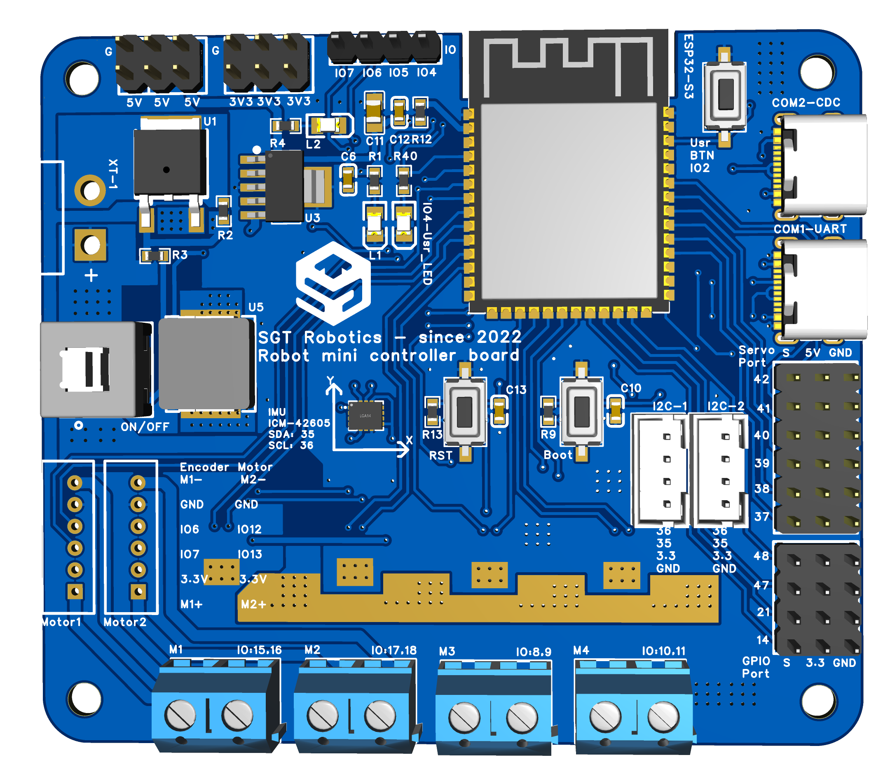
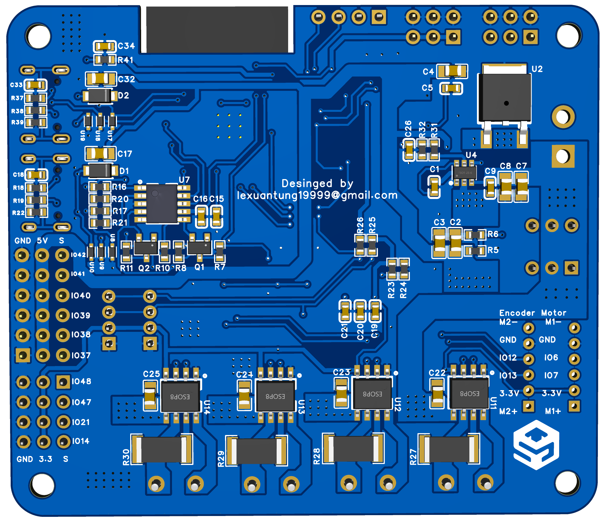

# ControlBoard v1.0



*Figure 1. ControlBoard v1.0 Top View*



*Figure 2. ControlBoard v1.0 Bottom View*

ControlBoard v1.0 is a compact and powerful embedded control board designed for robotics applications such as mobile robots, soccer robots, servo mechanisms, and sensor integration systems.

The board is built around the **ESP32-S3** microcontroller and integrates multiple motor drivers, servo expansion, communication interfaces, and onboard sensing capabilities.

# Mini Controller Board v1.0

<div align="center">
  
  <br>
  <em>Figure 1. Mini Controller Board v1.0 Top View</em>
</div>

<div align="center">
  
  <br>
  <em>Figure 2. Mini Controller Board v1.0 Bottom View</em>
</div>

Mini Controller Board v1.0 is a compact embedded control board designed for robotics applications such as mobile robots, line-following robots, mini soccer robots, servo control systems, and sensor integration platforms.

The board is built around the **ESP32-S3** microcontroller and integrates DC motor drivers, onboard IMU, servo ports, encoder interfaces, and general-purpose I/O expansion.

---

# Overview

- **Microcontroller:** ESP32-S3
- **Board Size:** 75 mm x 65 mm
- **Input Voltage:** 6VDC ~ 17VDC  
  Recommended: **12VDC (3S Li-ion / LiPo)**
- **Power Protection:**
  - Fuse protection
  - Dual MOSFET reverse polarity protection

---

# Power Output

| Output Rail | Max Current |
|---|---:|
| 5V Servo Power | 5A |
| 3.3V Logic Power | 1A |

---

# Communication Interfaces

| Interface | Description | Notes |
|---|---|---|
| UART to USB | Programming / Debugging | CH340x |
| USB CDC | Programming / Serial Monitor | Native USB |
| I2C | External sensor communication | 2x PH2.0 Port |
| IMU I2C | Onboard IMU | SDA: IO35, SCL: IO36 |

---

# Onboard Sensor

| Sensor | Interface | Pins |
|---|---|---|
| ICM-42605 6-axis IMU | I2C | SDA: IO35, SCL: IO36 |

---

# DC Motor Control

**Motor Driver:** AT8236  
- Continuous current: **3A**
- Peak current: **6A**

| Motor Port | Pin A | Pin B |
|---|---|---|
| M1 | IO15 | IO16 |
| M2 | IO17 | IO18 |
| M3 | IO8  | IO9  |
| M4 | IO10 | IO11 |

---

# Encoder Ports

| Encoder Port | Channel A | Channel B |
|---|---|---|
| Encoder 1 | IO7 | IO6 |
| Encoder 2 | IO13 | IO12 |

---

# Servo Control

| Servo Port | GPIO |
|---|---|
| Servo 1 | IO37 |
| Servo 2 | IO38 |
| Servo 3 | IO39 |
| Servo 4 | IO40 |
| Servo 5 | IO41 |
| Servo 6 | IO42 |

---

# General Purpose Input Ports

| Port | Pin |
|---|---|
| Input 1 | IO14 |
| Input 2 | IO21 |
| Input 3 | IO47 |
| Input 4 | IO48 |

---

# Buttons and Indicators

| Function | Pin |
|---|---|
| Onboard LED | IO4 |
| User Button / Boot | IO2 |

Additional buttons:
- 1x Reset button
- 1x Boot button

---

# Firmware Pin Defines

```cpp
// IMU
#define IMU_I2C_SDA      35
#define IMU_I2C_SCL      36

// DC Motors
#define MOTOR_M1_A       15
#define MOTOR_M1_B       16

#define MOTOR_M2_A       17
#define MOTOR_M2_B       18

#define MOTOR_M3_A       8
#define MOTOR_M3_B       9

#define MOTOR_M4_A       10
#define MOTOR_M4_B       11

// Servo Ports
#define SERVO_1          37
#define SERVO_2          38
#define SERVO_3          39
#define SERVO_4          40
#define SERVO_5          41
#define SERVO_6          42

// Encoders
#define ENCODER1_A       7
#define ENCODER1_B       6

#define ENCODER2_A       13
#define ENCODER2_B       12

// General Inputs
#define INPUT_1          14
#define INPUT_2          21
#define INPUT_3          47
#define INPUT_4          48

// Onboard Devices
#define LED_ONBOARD      4
#define USER_BUTTON      2
```

# Getting Started

1. Install [PlatformIO](https://platformio.org/)
2. Clone this repository
3. Open the project in VS Code with PlatformIO extension
4. Connect your ESP32-S3 board via USB
5. Build and upload: `platformio run --target upload`

---

# Project Structure

- `src/` - Main firmware code
- `lib/` - Reusable libraries (MotorControl, ServoControl, etc.)
- `include/` - Header files and board configuration
- `test/` - Test code
- `platformio.ini` - PlatformIO configuration